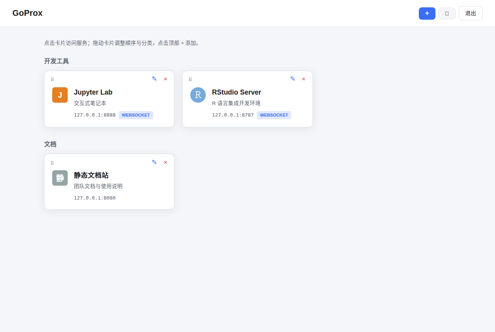
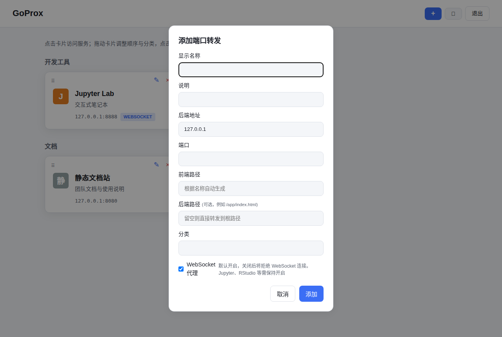

# SRCOS

> 📖 设计与实施文档见 [`docs/roadmap.md`](docs/roadmap.md)（设计思想、架构与进度）和 [`docs/`](docs/) 目录。

**一台服务器，一个 Web 入口，每人管理自己的 Jupyter / RStudio / 内网服务。**

SRCOS 是面向实验室、登录节点的**多用户认证反向代理**网关，用 Go 语言编写。运维启动一个共享网关并创建用户账号，每个用户登录网页管理自己的转发（添加卡片、拖动排序），无需每人记不同端口。

## 安装

```bash
go install github.com/seqyuan/srcos@latest
```

安装后 `srcos` 位于 `$GOPATH/bin`（通常是 `~/go/bin`）。

> **重要：请把二进制拷贝（不是链接）到独立目录再运行。**
> 所有配置都存放在**二进制旁边的 `config/` 目录**，因此整个目录可以整体拷贝、备份、迁移。`os.Executable` 会解析符号链接，所以**不要用 `ln -s` 链接**，否则配置会落在链接目标的真实路径下。

```bash
mkdir -p /opt/srcos
cp ~/go/bin/srcos /opt/srcos/
```

如果 `go install` 后直接在 `~/go/bin` 里运行，配置会写在 `~/go/bin/config/`，也可以接受，但建议放到独立目录。

## 版本

`srcos --help` 第一行显示版本号。版本来自最近的 git tag，构建时注入：

```bash
make build        # 等价于 go build -ldflags "-X main.version=$(git describe --tags --abbrev=0)"
```

本地直接用 `go build` / `go install`（不带 ldflags）时版本显示为 `dev`。

## 快速开始

三步即可上线：

```bash
# ① 把 srcos 拷贝到独立目录（见「安装」）
cd /opt/srcos

# ② 管理员创建用户账号（交互式设置密码，一条命令一个用户）
./srcos user alice
./srcos user bob

# ③ 启动网关 —— 日常只需记住这一条命令
./srcos serve --port 30152
```

- 浏览器访问 `http://lab.example.com:30152/`，用刚创建的账号登录；
- 登录后点 **+** 添加自己的服务卡片，拖动排序，点击卡片访问。
- **两步验证（TOTP）默认不开启**，纯密码即可登录；需要时在仪表盘点「两步验证未开启 · 开启」自助绑定（详见下方「两步验证」章节）。

> **`--port` 只在第一次启动时需要指定**，之后端口会记录在 `config/state.yaml`，直接 `./srcos serve` 即可。

## 日常管理

| 想做什么 | 命令 |
|---|---|
| 启动网关 | `./srcos serve`（前台运行） |
| 停止网关 | `Ctrl+C` |
| 查看运行日志 | 终端直接显示；重定向到文件后用 `tail -f` |

> 需要常驻后台？放进 `tmux`/`screen` 会话，或 `nohup ./srcos serve > srcos.log 2>&1 &`。
> 配置目录即程序旁边的 `config/`（可用 `-d <dir>` 指定，见下方 Options）。

## 公网部署（HTTPS）

暴露到公网前，请先在网关前放一个反向代理终结 TLS（Caddy / nginx），
并让 SRCOS 只监听回环 + 设置 `--trusted-proxy`。详见 **[docs/reverse-proxy-tls.md](docs/reverse-proxy-tls.md)**。

如果走 **Cloudflare 隧道（cloudflared）** 把公网域名转发到本机 HTTPS 端口，
注意 cloudflared 会严格校验 origin 证书（自签证书会被拒、Origin CA 存在
hostname 不匹配问题）——正解是本地 CA + `localhost` SAN + 系统信任库 +
重启 cloudflared（Go 进程缓存根证书池），完整步骤见
**[Cloudflare 隧道对接](docs/tunnel.md)**。

## 原生 TLS（局域网 HTTPS）

局域网部署不想在网关前再挂一层反代？SRCOS 可以直接终结 TLS：

```bash
# 自动生成自签证书（覆盖 localhost + 本机所有局域网 IP），直接 HTTPS
./srcos serve --port 30152 --tls-selfsigned

# 或者用你自己的证书
./srcos serve --port 30152 --tls-cert server.crt --tls-key server.key
```

HTTPS 把整个站点变成**安全上下文**，代理的 Web 应用就能用上所有安全上下文 API——
`crypto.randomUUID`、`crypto.subtle`、`navigator.storage`、剪贴板、地理定位等——
纯 HTTP 局域网下这些 API 是缺失的。自签证书首次访问有浏览器警告（点一次「继续」即可），
证书与私钥存在 `config/tls/`（0600）。

TLS 设置会持久化到 `state.yaml`（`tls_cert` / `tls_key`），之后的 `srcos serve`
自动保持 HTTPS；要关闭请删除这两行后重启（与 `trusted_proxy` 同样的语义）。

## 命令参考

```bash
# 日常使用
./srcos serve [options]    启动网关（前台运行，日志打印到终端，Ctrl+C 停止）

# 用户管理（管理员）
./srcos user <name>        创建用户账号（交互设置密码）
./srcos passwd <name>      重置用户密码
./srcos del <name>         删除用户账号（同时撤销该用户全部 agent token）
./srcos 2fa-reset <name>   关闭指定用户的两步验证

# Agent token（程序凭据，给 agent / MCP 客户端用；只存哈希）
./srcos token create --user alice --label annovibe   创建（明文只显示一次）
./srcos token list                                   列出（含过期时间与最近使用）
./srcos token revoke <id>                            撤销一个（立即生效，无需重启）
./srcos token revoke --user alice --all              撤销某用户的全部 token

# 轻量级单点登录（可选）
./srcos sso                                查看当前 SSO 配置
./srcos sso --user-header X-Authenticated-User \
            --hmac-secret <key>              启用 SSO（身份头 + HMAC 签名）
./srcos sso --off                           关闭 SSO

# 审计（谁做了什么，ADR-024）
./srcos audit tail -n 20                     最近 20 条结构化审计记录
./srcos audit list --decision deny           只看被拒绝的请求

Options:
  -d, --config-dir <dir>  配置目录（默认 <程序目录>/config）
  --host <host>           监听地址（默认 0.0.0.0）
  --port <port>           监听端口（默认 30152）
  --trusted-proxy <cidr>  可信反向代理网段（如 127.0.0.1/32），
                          启用后信任其 X-Forwarded-For/Proto 头（默认不信任）
  --tls-cert <file>       TLS 证书（PEM），与 --tls-key 一起启用 HTTPS
  --tls-key <file>        TLS 私钥（PEM）
  --tls-selfsigned        生成自签证书并启用 HTTPS（覆盖 localhost + 局域网 IP）
  --title <text>          页面左上角显示的站点标题（默认 SRCOS），
                          支持中文/emoji，如 --title "🧬 生信分析平台"
  -h, --help              显示帮助
```

`user` / `passwd` / `del` 需要与网关相同的目录写权限（root 启动的网关，管理命令也用 root 执行）。
> 这三个命令的用户名需写在选项**之前**：`srcos user alice -d /opt/srcos/config`，
> 不能写成 `srcos user -d ... alice`。

## 目录结构

```text
/opt/srcos/
├── srcos                  # 二进制
├── config/                 # 0700，网关属主
│   ├── state.yaml          # 网关状态（监听地址/端口、trusted_proxy、session_secret）
│   ├── agent-tokens.yaml   # agent token（只存 SHA-256 哈希；`srcos token` 维护）
│   └── users/              # 每个用户一个独立配置文件
│       ├── alice.yaml
│       └── bob.yaml
└── data/                   # 运行态（虚拟 home / workspace / 实例记录 / token 使用时间）
```

多用户共享同一端口：登录后每个用户只能看到和管理自己的服务，访问路径为 `/proxy/<用户名>/<服务>/`。

**平台自己起的服务实例也走同一条代理路径**：`srcos svc start` 起的长驻工具实例会在
`/proxy/<用户名>/<工具 id>/` 上可达（网关从实例记录里重建路由表，CLI 与网关是两个进程也不需要重启网关）。
同名时**活着的实例优先于静态卡片**，因为卡片只是手写的指针、可能已经指向没人监听的端口。

## 配置文件

### 用户配置 (`config/users/<用户名>.yaml`)

```yaml
auth:
  password_hash: "$2a$10$YVpm1R6puQFltjmrKziLsujVtAJDJIynTC54yESGslrkmyP5ORBTO"  # bcrypt（srcos user/passwd 生成）
  # totp_secret: "GEZDGNBVGY3TQOJQGEZDGNBVGY3TQOJQ"   # 可选：TOTP 两步验证密钥（base32），缺省/删除 = 关闭
services:
  # ① 本机服务：后端与网关在同一台机器，host 用 127.0.0.1
  - id: jupyter
    name: "Jupyter Lab"
    description: "交互式笔记本"
    host: "127.0.0.1"
    port: 8888
    path: "/jupyter"
    websocket: true
    category: "开发工具"
    order: 0
    # bwlimit: 10485760              # 可选：该服务带宽上限（字节/秒，0/缺省 = 不限速）

  # ② 局域网其他机器：host 填对方机器的局域网 IP（如实验室服务器 192.168.0.109）
  - id: rstudio
    name: "RStudio（服务器）"
    description: "运行在 192.168.0.109 的 RStudio Server"
    host: "192.168.0.109"
    port: 8787
    path: "/rstudio"
    websocket: true
    category: "开发工具"
    order: 1

  # ③ 单 HTML 网页：后端只提供一个入口文件（如数据分析报告）
  - id: report
    name: "分析报告"
    description: "单 HTML 网页报告"
    host: "127.0.0.1"
    port: 8080
    path: "/report"
    websocket: false
    category: "未分类"
    order: 2
    backend_path: "/report.html"    # 后端入口文件（见下方 BackendPath ③）
```

> `host` 可以是回环地址（`127.0.0.1`）或局域网私网 IP（`192.168.x.x`、`10.x.x.x`、`172.16-31.x.x`），
> 也支持能解析到私网的主机名；公网地址与链路本地/云元数据地址会被拒绝。
> `backend_path` 指向单个 HTML 文件时，子资源（JS/CSS/图片）会相对该文件所在目录解析。

### 默认服务（default_service，根路径托管）

用户配置里可以指定一个默认服务，把**未被认领的裸路径**（网关根路径下不属于任何服务、
也不是网关自身的路径）确定性地路由到它：

```yaml
# 在用户配置的 services 之前声明
default_service: xifeng   # 服务 ID
services:
  - id: xifeng
    ...
```

这让**根路由型 SPA**（Nuxt / Next.js / Vite 客户端路由，按 `window.location.pathname`
匹配根路径路由、无法理解 `/proxy/<用户>/<服务>/` 前缀）在网关根路径下零改动可用：

```text
访问 /dashboard          → 转发到默认服务后端 /dashboard（页面类路径确定性路由）
访问 /dashboard/api      → 同上（Nuxt 页面路由）
页面内 /api/web/... 请求 → 跟随页面 Referer / 路由 cookie 转发到同一服务
```

资源类路径（带扩展名的静态文件、`/api/`、`/plugins/`、`/_nuxt/` 等）不会抢占默认服务，
而是跟随**发起请求的页面**（Referer / 最近访问路由 cookie）转发——所以多服务并存时，
每个服务的页面资源和 API 仍然各回各家。未配置 `default_service` 的用户行为不变
（裸路径仍按 Referer → 最近访问路由 cookie 转发）。

#### 卡片（服务）参数一览

**仪表盘上的服务卡片**（点击卡片访问服务；✎ 编辑、× 删除、⋮⋮ 拖动排序）：



**添加 / 编辑服务的表单**（即卡片的全部可配置参数）：



> 在网页「+ 添加 / 编辑」弹窗、或 `/api/services` 接口中配置以上字段；`id`、`order` 由系统自动维护。

<details>
<summary>📋 文字版参数表（便于检索 / 复制）</summary>

| 参数 | 类型 | 必填 | 默认值 | 说明 |
|---|---|---|---|---|
| `name` | string | ✅ | — | 卡片显示名称（≤200 字符） |
| `host` | string | — | `127.0.0.1` | 后端地址，仅允许回环/私网 IP 或主机名（如 `127.0.0.1`、`192.168.0.109`、`10.0.1.5`；公网、链路本地/云元数据地址被拒） |
| `port` | int | ✅ | — | 后端端口（1–65535） |
| `path` | string | — | 按 `id` 自动生成 | 前端访问路径，如 `/jupyter`；仅允许 `A-Za-z0-9._~-` 与 `/`，同用户内唯一 |
| `backend_path` | string | — | 空 | 后端实际监听子路径/文件，如 `/app/index.html`（见下方 BackendPath 说明） |
| `websocket` | bool | — | `true` | 是否允许 WebSocket 升级（Jupyter/RStudio 需开启） |
| `bwlimit` | int | — | `0` | 该服务带宽上限（字节/秒），上行/下行各限 `bwlimit`，`0`/缺省 = 不限速 |
| `description` | string | — | 空 | 说明文字（≤500 字符） |
| `category` | string | — | 未分类 | 分类/分组名（≤100 字符） |
| `id` | string | — | 🔒 系统自动 | 服务唯一 ID，由名称自动生成，重名自动加 `-2`、`-3`… |
| `order` | int | — | 🔒 系统自动 | 排序号（新增 = 最大 order+1，拖拽排序时更新） |

</details>

> `password_hash` 为新版 `srcos user` / `srcos passwd` 生成的 **bcrypt** 哈希（`$2a$10$...`，示例值是口令 `change-me`）。
> 旧版遗留的 SHA-256 哈希兼容细节见下方「密码存储」。

### 网关状态 (`config/state.yaml`)

```yaml
server:
  host: "0.0.0.0"
  port: 30152
  # 仅在网关前面有反向代理时设置：
  # trusted_proxy: "127.0.0.1/32"
  # 页面左上角标题（可选，默认 SRCOS），如 "🧬 生信分析平台"
  # title: "🧬 生信分析平台"
auth:
  session_secret: "<auto-generated>"
  session_ttl: 86400
```

> **安全说明**：默认不信任 `X-Forwarded-For` / `X-Forwarded-Proto`（直连客户端可伪造，
> 会导致登录限流失效与 Secure Cookie 异常）。只有在网关部署于可信反向代理之后时，
> 才设置 `trusted_proxy`（或用 `srcos serve --trusted-proxy 127.0.0.1/32`）。
>
> **清除方法**：`trusted_proxy` 一旦写入会一直生效（与 `host`/`port` 相同的语义，
> 去掉启动参数不会清除它）。要关闭请编辑 `config/state.yaml`，删除 `trusted_proxy` 行
> 后重启网关。每次启动时日志会打印当前生效值（`trusted proxy: ...`），可据此确认。

### 轻量级单点登录（`sso`，可选）

登录网关一次后，把当前用户名以请求头的形式带给后端服务，后端信任该头即可
“免登录”识别用户——适合个人 Jupyter / RStudio / dsh 这类挂在网关后面的服务。
用 `srcos sso` 配置，写入 `config/state.yaml` 的 `sso` 段：

```yaml
sso:
  user_header: X-Authenticated-User   # 携带登录用户名的请求头名；空 = 关闭
  hmac_secret: ""                      # 可选：设置后同时下发 HMAC 签名头
```

- `user_header`：每次代理请求都会带上 `user_header: <登录用户名>`，后端读取即知当前用户；
- `hmac_secret`：可选共享密钥。设置后每个请求还带 `user_header-Signature` 头，值为
  `HMAC-SHA256(secret, "srcos-sso:v1:" + 用户名)` 的 base64url（无填充）编码，
  后端验签即可确认身份，不再完全依赖网络隔离。

> **安全前提（重要）**：身份头是后端的唯一身份凭证，因此后端**必须只能经网关访问**
> （只监听回环地址或防火墙仅放行网关），否则任何能直连后端的人都可以伪造
> `X-Authenticated-User: admin` 冒充任意用户。无法保证网络隔离时，务必设置
> `hmac_secret` 并用 `hmac.Equal` 验签（见下方示例）。
> 网关始终**覆盖**客户端传入的身份头（绝不透传），并剥离 `X-Authenticated-User`、
> `X-Forwarded-User`、`X-Auth-Request-User`、`Remote-User`、`Remote_User` 等常见身份头，
> 防止浏览器伪造。改动后需重启网关生效（启动日志会打印 `sso: ...`）。

后端验签示例（Go）：

```go
user := r.Header.Get("X-Authenticated-User")
sig := r.Header.Get("X-Authenticated-User-Signature")
mac := hmac.New(sha256.New, []byte(secret))
mac.Write([]byte("srcos-sso:v1:" + user))
if !hmac.Equal([]byte(sig), []byte(base64.RawURLEncoding.EncodeToString(mac.Sum(nil)))) {
    http.Error(w, "bad sso signature", http.StatusUnauthorized)
}
```

### 密码存储

密码使用 **bcrypt** 哈希（`srcos user` / `srcos passwd` 生成）。旧版本遗留的
SHA-256 哈希仍可正常登录（自动兼容），建议在方便时用 `srcos passwd` 重置一遍。

### 两步验证（TOTP，可选）

暴露到公网时，强烈建议为账号开启**基于时间的一次性密码（TOTP）**二次验证。
按用户可选，开启后登录需要密码 + 认证器 App 显示的 6 位动态码。

**开启 / 更换**（用户自助，登录后操作）：

1. 登录仪表盘，点顶部提示中的「两步验证未开启 · 开启」链接；
2. 用手机认证器 App（Google Authenticator / Authy / 1Password）扫描二维码，或手动输入密钥；
3. 输入 App 当前显示的 6 位动态码，确认后即生效。

**登录流程**（开启后）：密码正确 → 输入 6 位动态码 → 进入仪表盘。

**手机丢失 / 忘记**：管理员在服务器上执行（无需登录）：

```bash
srcos 2fa-reset <用户名>
```

> 密钥以 base32 形式存在 `config/users/<用户名>.yaml` 的 `auth.totp_secret` 字段（权限 0600，
> 与 `session_secret` 同级保护）。动态码校验带有 ±1 个 30 秒窗口的时钟容错，且同样受登录限速保护。

### Agent token（`config/agent-tokens.yaml`，程序凭据）

浏览器用 session cookie，程序（agent、MCP 客户端、脚本）用 **agent token**：
`Authorization: Bearer <token>`。它解决的是「agent 是程序，拿不到也不能用浏览器 cookie」。

用户也可以**自己在网页上生成**（仪表盘右上角「令牌」→ `/tokens`）：勾选 scope（`read` / `submit`）、
可选按工具收窄白名单、选有效期，明文只在生成时显示一次（不会进 URL、不会出现在列表里）。

```bash
# 创建（明文只在这一次输出，之后只剩哈希，无法恢复）
srcos token create -d /opt/srcos/config --user alice --label annovibe --expires 90d
#   → srcos_hml5na3g.kVC-NFz6WrBzarEWERINKmzdygunpiUBr9JaNyor-3Q

# 给 agent 执行权：submit scope（蕴含 read），并可用 --tool 按工具收窄
srcos token create -d /opt/srcos/config --user alice --label ci \
  --scope submit --tool ticker --tool demo

# 列出 / 撤销（撤销立即生效，网关无需重启）
srcos token list   -d /opt/srcos/config
srcos token revoke -d /opt/srcos/config <id>

# 使用：读工具目录、路径、任务状态（read 面）
curl -H 'Authorization: Bearer srcos_...' http://gw:30152/api/tools
```

- **只存哈希**：`config/agent-tokens.yaml` 是 SHA-256 哈希 + 用户 + scope + 工具白名单 + 过期 + 标签，
  没有明文。因此这份文件（或它的备份）泄露不等于凭据泄露。
- **自助但不可提权**：`/tokens` 只能给**自己**签发（没有"给谁签"这个字段）；白名单只能从**你自己
  可见的工具**里勾，且每次真正运行时仍要过 Grant 与配额。**管理凭据只认浏览器 session** ——
  agent token 不能自己造或撤 token（否则一个泄露的 submit token 可以给自己续一条长期凭据，
  活得比撤销还久）。
- **scope 只收窄不放宽**：token 以「所属用户」的身份行事，Grant 授权策略照常生效；
  scope 只能在其之上收窄。两个 scope：
  - `read`（默认）—— 目录、路径、状态、日志、产物；
  - `submit` —— 提交运行 / 取消 / 跑流程，**蕴含 `read`**（只能开工不能看结果的凭据只会让持有者盲动）。
    `--tool <id>` 可重复，把 `submit` 按工具收窄；空 = 该用户可见的全部工具。
- **submit 授权是工具 × 用户双维度**：token 需 `submit`；`--tool` 白名单再按工具收窄；
  owner 的 Grant 与配额仍是外层上界（白名单只能收窄，不能放宽）。跑流程时对**每个节点的工具**都校验，
  所以一个只能跑 `ticker` 的 token 不能靠组合把别的工具洗进来。
- **过期**：默认 90 天，`--expires never` 可取消，`--expires 2026-12-21` / `12h` 亦可。
- **删除用户即撤销**：`srcos del <user>` 会一并撤销该用户的 token；即使文件里残留，
  网关也会因用户不存在而拒绝（需存在才算有效凭据）。
- **失败关闭**：文件被改坏时**所有** token 立即失效（日志提示），修好即恢复，
  不会沿用旧快照。
- **使用时间**存在 `data/agent-token-usage.yaml`（运行态，网关写入，按 token 降频），
  与 `config/` 里的凭据文件分开，避免两个进程互相覆盖；`token list` 会读它。

### 管理 API 的 CSRF 防护

管理 API（增删改服务、调整布局）和登录接口会对浏览器请求校验 `Origin` 头：
跨站页面（钓鱼网站、恶意网页）发起的请求会被拒绝（403）。非浏览器客户端
（curl、脚本）不带 `Origin`，不受影响。

> 带 `Authorization: Bearer` 的 agent token 请求不受 `Origin` 校验约束：token 不是
> 浏览器自动携带的凭据，跨站页面无法借它发起请求；而程序客户端（含部分 MCP 客户端）
> 可能带自己的 `Origin`。它仍然受 scope 限制（第一期只读）。

> **残余风险说明**：通过网关代理的后端服务与网关**同源**（同一主机/端口），
> 因此任何被代理页面中的脚本都可以像用户本人一样调用管理 API（浏览器自动携带
> 会话 cookie，且 Origin 天然同源）。请勿在网关后面代理不可信、可执行任意脚本的
> 应用；如需严格隔离，请把管理界面部署在独立的主机/端口（独立 origin）。
> 同理，登录成功后请勿在不可信服务页面中保持登录状态。

### 保留路径（命名空间冲突）

网关自身占用以下固定路径，**不会**转发给任何后端服务：

| 路径 | 用途 |
|---|---|
| `/login` | 网关登录页 / 登录提交 |
| `/logout` | 退出登录 |
| `/favicon.ico` | 网关自身图标 |
| `/api/services`、`/api/services/*` | 卡片增删改、布局调整的 REST API |
| `/api/tools`、`/api/tools/*` | 工具目录与机器可读的 `interface` |
| `/api/paths` | 路径浏览（`type: path` 参数的选择器后台） |
| `/api/jobs`、`/api/jobs/*` | 任务提交、实例列表与**日志**（`/api/jobs/<id>/logs`，加 `?follow=1` 即为 SSE 实时流）；`POST /api/jobs/<id>/cancel` 取消 |
| `/api/flows/*` | `POST /api/flows/<id>/run` 用 CSV 样本表展开并启动一个流程 |
| `/api/tokens`、`/api/tokens/*` | **agent token 自助管理**（列表 / 新建 / 撤销；只认浏览器 session，agent token 不能自己造 token） |
| `/api/resources`、`/api/resources/raw`、`/api/resources/html` | **`srcos://` 资源协议**（元数据 / 字节 / sandbox 化的用户 HTML） |
| `/view` | **内置资源查看器**（文本、Markdown、表格、图片、PDF、HTML、目录） |
| `/mcp` | **MCP 端点**（Streamable HTTP，只读面，给 agent / MCP 客户端；用 agent token 认证） |
| `/admin` | **管理控制台**（仅管理员：实例总览 / 强制停止 / 授权管理） |
| `/api/admin`、`/api/admin/*` | 管理 API（仅管理员；控制台调用它，也可脚本化） |
| `/assets/*` | 平台提供的原语控件（如 `srcos-path-picker.js`） |
| `/tools`、`/tools/*` | 工具目录页与自动生成的参数表单 |
| `/proxy/*` | 服务代理前缀（静态卡片与服务实例路由共用；见「服务实例的动态路由」） |

如果某个后端应用也使用这些**绝对路径**（例如后端自己也有 `/login` 页面、或 `/api/services` 接口），浏览器会命中网关而非后端。此时应让后端改用不冲突的路径，或为其配置 base_url/basePath 使链接落在 `/proxy/<用户>/<服务路径>/` 之下。

## 服务实例的动态路由（`/proxy/<用户名>/<工具 id>/`）

工具声明 `kind: service` 时，`srcos svc start` 起的是一个由 SRCOS 管理的长驻实例：端口从端口池分配、
只监听 127.0.0.1，并且**会自动在网关上可达**：

```bash
./srcos svc start -d /opt/srcos/config --tools-dir srcos-tools --user alice --tool websvc
#   → route  http://<gateway>/proxy/alice/websvc
curl -b cj http://<gateway>:30152/proxy/alice/websvc/     # 实例的根路径
```

- **谁在维护这张表**：网关从 `data/instances/*.yaml` 重建动态路由表（启动时 + 每 10 秒扫描一次），
  并在路径查不到时**按需读一次实例记录** —— 所以「刚 `svc start` 完就点链接」不会 404，也不需要重启网关。
- **只有活着的实例才在表里**：`running` / `idle` 会被发布；`starting` / `stopping` / 已终态的不发布。
  `idle`（一段时间没流量）仍在服务，所以仍可访问。
- **实例优先于卡片**：同一路径既有实例又有静态卡片时用实例（卡片是手写指针，可能已过期）；
  实例停了以后卡片就是兜底。
- **宿主路径与端点来自记录，且必须是回环地址**：记录被手工改成 `10.0.0.5:80`、`169.254.169.254:80`
  这类地址时不会成为路由（否则网关就成了 SSRF 跳板）。
- **停止后的表现**：`svc stop` 在另一个进程里执行，网关下一次请求可能先得到一个诚实的 502，
  随后该路由被丢弃、再请求就是 404（实例记录才是事实）。
- **裸路径（SPA）**：实例服务同样支持路由 cookie 与 Referer 回投 —— 页面生成的绝对路径
  （`/api/...`、`/_next/...`）会被带回该实例，与静态卡片行为一致。WebSocket 默认允许。
- **短链接**：直接访问 `/<工具 id>/...`（如 `/websvc/lab`）会 302 到
  `/proxy/<用户名>/<工具 id>/...`，与静态卡片的裸路径行为一致。
- **启动中不是 404**：实例还在拉起时，浏览器访问该路径会看到「服务启动中」进度页
  （503 + `Retry-After`，页面自动刷新，附日志末尾），就绪后本页自动变成服务本身；
  实例失败/已停止则显示原因与日志（502），并给出重启命令。
- **网关自己回收**：网关按工具的 `lifecycle` 执行回收（`idle_ttl` / `max_lifetime`），
  `idle_ttl` 计的是**流量**而不是"启动多久" —— 代理每次转发都记录活跃时间
  （`data/service-activity.yaml`），有开着的 WebSocket 也算活跃，所以正在用的服务不会被回收。
- **重启网关不丢服务**：网关启动时会 reconcile（还活着就收养、已死就标 stopped），
  不是简单相信记录。

## WebSocket 代理

Jupyter、RStudio 等需要 WebSocket 的服务，请保持卡片的 **WebSocket 开关开启**（网页添加时默认勾选；API 未提供该字段时也默认开启），或设置 `websocket: true`。

关闭此选项后，WebSocket 升级请求会被拒绝（返回 403），普通 HTTP 不受影响。

## 后端服务配置指南

SRCOS 会自动向后端返回的 HTML 页面注入 `<base href="/proxy/<用户>/<服务路径>/">` 标签，
因此**未配置 base_url 的应用通常也能正常加载相对路径资源**（图片、JS、CSS）。
但如果后端生成的是**绝对路径**链接（如 `/lab`、`/api/...`），仍需配置服务的 base_url
使其与代理前缀一致，否则这类链接会落到网关根路径上。

> **安全上下文 Web API 兼容**：同一处注入还会附带一个极小的内联脚本，在
> `crypto.randomUUID` 缺失时用 `crypto.getRandomValues` 补上（浏览器只在 HTTPS/
> localhost 等安全上下文暴露 `randomUUID`，纯 HTTP 局域网部署下调用它会被应用报
> “crypto.randomUUID is not a function”）。脚本是幂等的：HTTPS 下已存在原生实现时
> 为无操作，页面从不调用时也无副作用；受 CSP 限制的页面会静默跳过它。

> **绝对路径的兜底转发**：后端页面里的绝对路径（如 `/_next/static/...`、`/favicon.svg`、
> `/api/...`）会被浏览器解析到网关根路径；SRCOS 会用「最近访问的服务」cookie 把这些
> 请求转发回对应后端，因此**初次加载和直接访问资源通常可用**。但该机制依赖会话与
> cookie，且在多服务切换、无 `Referer` 的请求等场景下只能按「最近访问的服务」猜测。
> 对于重度依赖绝对路径的单页应用，推荐配置 basePath/base_url 与代理前缀一致以获得
> 稳定行为。

### 单页应用（SPA / Next.js）

Next.js 等 SPA 会生成大量绝对路径（`/_next/static/...`、`/favicon.svg`、`/api/...`、
`/workspace` 等），未配置 `basePath` 时：

- 服务端重定向（`Location`）会被 SRCOS 自动改写回代理前缀内，登录/跳转流程可用；
- 静态资源与 API 请求靠「最近访问的服务」cookie 兜底转发，首次访问与直链可用；
- 客户端路由（`<Link>` / `router.push`）基于浏览器当前路径，可能不受 `<base>` 影响，
  建议为后端配置与代理前缀一致的 `basePath`（Next.js）或 base_url（其他框架）。

```js
// next.config.js —— 仅当该后端固定由同一用户、同一 path 代理时可这样配置
module.exports = { basePath: '/proxy/<用户>/<服务路径>' };
```

> 多用户网关下每个用户的代理前缀不同，无法写死一个 `basePath`；此时优先依赖 SRCOS
> 的兜底转发，并避免多个服务同时使用裸绝对路径资源的重负载页面。

### Jupyter Lab

```bash
jupyter lab \
  --ip=0.0.0.0 \
  --port=8888 \
  --NotebookApp.base_url='/proxy/<用户>/<服务路径>/' \
  --NotebookApp.token='' \
  --no-browser
```

或在 `~/.jupyter/jupyter_lab_config.py` 中：

```python
c.ServerApp.base_url = '/proxy/用户名/jupyter/'
c.ServerApp.token = ''
```

### Jupyter Notebook

```bash
jupyter notebook \
  --ip=0.0.0.0 \
  --port=8888 \
  --NotebookApp.base_url='/proxy/<用户>/<服务路径>/' \
  --NotebookApp.token='' \
  --no-browser
```

### RStudio Server

在 `/etc/rstudio/rserver.conf` 中：

```
www-address=127.0.0.1
www-port=8787
www-root-path=/proxy/<用户>/rstudio/
```

### Code Server (VS Code)

```bash
code-server \
  --bind-addr 127.0.0.1:8080 \
  --auth none \
  --base-path '/proxy/<用户>/code/'
```

> `--auth none` 表示不再单独认证，访问安全完全依赖 SRCOS 网关层登录，请确保网关只监听可信网络。

### dsh（DeepSeek Harness，本地优先应用）

dsh 是典型的**本地优先应用**：只监听 `127.0.0.1`、自带 Host/Origin 信任栅栏、前端还依赖
只在安全上下文（HTTPS/localhost）可用的 `crypto.randomUUID`。直接暴露给局域网会 403 / 报错，
但通过 SRCOS 无需改动 dsh 任何源码或配置即可接入：

```yaml
services:
  - id: dsh
    name: "dsh"
    description: "DeepSeek Harness Web GUI"
    host: "127.0.0.1"
    port: 3080
    path: "/dsh"
    websocket: true      # 事件流走 WebSocket/SSE，必须开启
    bwlimit: 10000000    # 可选：带宽上限
```

SRCOS 自动处理：① 同源 Origin 改写（通过 dsh 的 Host/Origin 信任栅栏）；② 向代理的 HTML
注入 `crypto.randomUUID` polyfill（纯 HTTP 下用 `getRandomValues` 重建，HTTPS 下自动失效）；
③ WebSocket 101 升级不受 `bwlimit` 影响。完整配置与排查见
[「dsh 配置示例」](docs/dsh-demo.md)。

> **注意**：将 `<用户>` 替换为 Linux 用户名，`<服务路径>` 替换为卡片中设置的 path 值。

### BackendPath（后端实际路径）

「前端路径 `path`」和「后端路径 `backend_path`」是两个不同概念：

| | 前端路径 `path` | 后端路径 `backend_path` |
|---|---|---|
| 是谁的路径 | 网关对外暴露的访问路径 | 后端服务自身实际监听的路径 |
| 用户是否可见 | 可见（浏览器地址栏） | 不可见（转发时拼接） |

转发规则：

```text
前端:  /proxy/<用户>/<path>/<剩余路径>
              ↓ 网关转发
后端:  <backend_path 或 根>/<剩余路径>
```

**三种典型配置：**

**① 后端挂在根目录（最常见，`backend_path` 留空）**

```yaml
services:
  - name: "Jupyter Lab"
    port: 8888
    path: "/jupyter"   # 前端路径
    # backend_path 留空
```

- 访问 `/proxy/alice/jupyter/` → 后端收到 `/`
- Jupyter / RStudio 等基本都是这种情况，留空即可。

**② 后端跑在某个子路径下**

后端 API 的所有路由都在 `/api/v1/...` 下：

```yaml
services:
  - name: "我的 API"
    port: 8000
    path: "/myapi"            # 前端路径
    backend_path: "/api/v1"   # 后端路径（目录前缀）
```

- 访问 `/proxy/alice/myapi/users` → 后端收到 `/api/v1/users`
- 访问 `/proxy/alice/myapi/` → 后端收到 `/api/v1`

**③ 单 HTML 网页（后端入口是一个文件）**

后端不是把页面挂在根路径，而是只提供一个 HTML 入口文件（常见于报告 / 展示页，
用 `python3 -m http.server` 或 nginx 托管）。例如入口文件是 `/report.html`：

```yaml
services:
  - name: "分析报告"
    host: "127.0.0.1"        # 网页在其他机器上时，填那台机器的局域网 IP，如 192.168.0.109
    port: 8080
    path: "/report"                   # 前端路径
    backend_path: "/report.html"      # 后端路径（入口文件）
```

- 访问 `/proxy/alice/report/` → 后端收到 `/report.html`
- 访问 `/proxy/alice/report/assets/app.js` → 后端收到 `/assets/app.js`（子资源相对入口文件所在目录）

**④ 后端静态站入口在子目录文件**

后端静态站首页是 `/public/index.html`（不是 `/`）：

```yaml
services:
  - name: "静态站点"
    host: "127.0.0.1"
    port: 8080
    path: "/docs"                       # 前端路径
    backend_path: "/public/index.html"  # 后端路径（文件）
```

- 访问 `/proxy/alice/docs/` → 后端收到 `/public/index.html`
- 访问 `/proxy/alice/docs/assets/app.js` → 后端收到 `/public/assets/app.js`

补充规则：

- `backend_path` 指向**文件**（含扩展名）时，子资源会解析到该文件所在目录；
- 后端重定向到该路径时，SRCOS 会先剥离 `backend_path` 再拼接代理前缀。

> **怎么判断要不要填 `backend_path`**：先留空，直接访问看能否打开；若 404 或资源路径不对，说明后端不是挂在根路径，再把它的实际前缀/入口文件填进 `backend_path`。

## 工具平台（Phase 1–3）

SRCOS 在网关之上还有一层**工具平台**：把工具注册进来，授权给用户，按需实例化，
每个实例带独立 workspace、CPU/内存限额与生命周期。

> **定位**：SRCOS 是 AI 平台的确定性执行后端。探索用 AI，执行用 SRCOS。
> 设计思想与全部决策见 [`docs/roadmap.md`](docs/roadmap.md)；
> 工具开发者要遵守的契约见 [`docs/tool-spec.md`](docs/tool-spec.md)；
> 重开会话或接手项目先读 [`docs/handoff.md`](docs/handoff.md)。

### 命令

```bash
# 工具：校验与列出（会顺带报告声明的沙箱在本机是否真的可用）
./srcos tool validate --tools-dir srcos-tools
./srcos tool list     --tools-dir srcos-tools

# 任务：提交 = 写 job.json 到投递目录（目录即队列）；**网关的任务队列会自动执行**
#      （任务跑在 systemd 瞬时 unit 里，日志与退出码都由 systemd 侧写下）
./srcos job submit -d /opt/srcos/config --tools-dir srcos-tools \
  -n "hello demo" --tool hello-fanout \
  --param samples=S001,S002,S003 --output /workspace/out
./srcos job list -d /opt/srcos/config
./srcos job logs -d /opt/srcos/config <instance-id>

# 没有网关的机器（或要立刻跑、要重试）时，手动消费队列：
./srcos job run  -d /opt/srcos/config --tools-dir srcos-tools --tool hello-fanout
./srcos job run  --tools-dir srcos-tools --tool hello-fanout --force   # 重跑已完成的

# 服务：长驻实例（端口池自动分配，探活通过后发布路由）
./srcos svc start -d /opt/srcos/config --tools-dir srcos-tools --tool <service-tool>
./srcos svc list  -d /opt/srcos/config
./srcos svc stop  -d /opt/srcos/config --tools-dir srcos-tools --tool <service-tool>
./srcos svc reconcile -d /opt/srcos/config   # 重启后收养仍活着的实例
./srcos svc reap      -d /opt/srcos/config   # 按 idleTTL / maxLifetime 回收

# 授权（默认拒绝：未被 grant 提到的工具对非管理员不可见）
./srcos grant group bio-team -d /opt/srcos/config --user alice --user bob
./srcos grant set cellranger -d /opt/srcos/config --group bio-team \
  --max-cpu 16 --max-memory 64Gi --max-instances 3
./srcos grant list -d /opt/srcos/config

# Agent token：给程序（agent / MCP 客户端 / 脚本）用的凭据，浏览器不用它
./srcos token create -d /opt/srcos/config --user alice --label annovibe
./srcos token list   -d /opt/srcos/config
./srcos token revoke -d /opt/srcos/config <id>
curl -H 'Authorization: Bearer srcos_...' http://127.0.0.1:30152/api/tools

# MCP（agent 的接口）：网关内置 /mcp，任何 MCP 客户端指向它即可
#   endpoint : http://<gateway>/mcp     （Streamable HTTP）
#   header   : Authorization: Bearer srcos_...

# 流程：把已注册工具按 output → input 连成 DAG（Phase 4 起步，只有校验与列举）
./srcos flow list     --flows-dir srcos-flows --tools-dir srcos-tools
./srcos flow validate --flows-dir srcos-flows --tools-dir srcos-tools

# 网关（新增 --tools-dir）
./srcos serve -d /opt/srcos/config --tools-dir srcos-tools --port 30152
```

### 配置

除原有的 `config/users/` 与 `config/state.yaml`，新增两份**管理员声明**：

| 文件 | 作用 | 示例 |
|---|---|---|
| `config/storages.yaml` | 共享数据根（工具通过 `type: path` 参数从中选择） | [`config/storages.example.yaml`](config/storages.example.yaml) |
| `config/grants.yaml` | 授权策略（谁可以用哪个工具、聚合配额多少） | [`config/grants.example.yaml`](config/grants.example.yaml) |
| `config/agent-tokens.yaml` | agent token（程序凭据，只存 SHA-256 哈希） | 由 `srcos token` 维护，见下文 |

### 网页入口

| 路径 | 作用 |
|---|---|
| `/tools` | 工具目录（只列出对你授权的工具） |
| `/tools/<工具>` | **从 `interface` 自动生成的参数表单**；路径参数用 `srcos-path-picker` 原语控件 |
| `/view` | **内置资源查看器**（见下节）；不带参数时列出你能看的根 |
| `/tasks`、`/tasks/<id>` | **任务列表与实例详情**（状态、产物、实时日志） |
| `/tokens` | **agent token 自助页**（生成 / 查看 / 撤销自己的程序凭据） |
| `/admin` | 管理控制台（仅管理员） |
| `/assets/srcos-path-picker.js` | 原语控件本体；工具自建 UI 一行标签即可复用 |

### 资源查看器（`srcos://`，内置 viewer）

平台自带一个查看器，**不依赖 dsh、不依赖 Node、不需要构建**：页面由 Go 模板在服务端渲染，
浏览器禁用 JavaScript 也能用。入口是 `/view`，不带参数时会列出你**有权看的根**
（你的 home、各工具的工作区、已授权的共享数据）。

地址语法与 dsh 的 `dsh-resource://<protocol>/<scope>/<path>` **同构**（ADR-011/016，
将来写适配器只需字符串改写）：

```
srcos://<provider>/<scope>/<path>[?tool=<tool-id>]

  provider  file（目前唯一实现；留给将来的 artifact / log 等）
  scope     home | workspace | <storage id>
  path      相对 scope 根，按 RFC 3986 转义（? # % 需转义）
  tool      仅 scope=workspace 需要（/workspace 的宿主目录取决于工具）
```

```bash
# 目录 → home 根
/view?src=srcos%3A%2F%2Ffile%2Fhome
# 工作区文件（工具写在地址里）
/view?src=srcos%3A%2F%2Ffile%2Fworkspace%2Fcounts.txt%3Ftool%3Ddemo
# 已声明 storage 里的文件
/view?src=srcos%3A%2F%2Ffile%2Fshare%2Fref%2Fgenes.tsv

# 同一份解析结果（脚本 / 工具自建 UI 可用）
curl -b cj 'http://<gateway>/api/resources?src=srcos%3A%2F%2Ffile%2Fhome%2Fnotes.md'
curl -b cj -o out.tsv \
  'http://<gateway>/api/resources/raw?src=srcos%3A%2F%2Ffile%2Fshare%2Fref%2Fgenes.tsv'  # 字节（支持 Range）
```

| 端点 | 作用 |
|---|---|
| `GET /api/resources` | 元数据：沙箱路径、大小、mtime、读写模式、**认领的 viewer**；目录则返回条目；不带 `src` 时返回可浏览的根列表 |
| `GET /api/resources/raw` | 原始字节。类型只从**安全集合**里选（图片 / PDF 给真类型，其余一律 `text/plain`） |
| `GET /api/resources/html` | 用户 HTML，**只给 sandbox iframe 用**（见下） |

首批 viewer（按文件名的 glob 认领，`patterns` 与优先级随元数据一起返回）：

| viewer | 认领 | 渲染 |
|---|---|---|
| `text` | 兜底 | 行号 + 分页显示；二进制会明确说明而不是显示乱码 |
| `markdown` | `*.md` 等 | 服务端渲染（CommonMark/GFM 子集；不支持内联 HTML——这正是不需要额外清洗器的原因） |
| `table` | `*.csv` `*.tsv` `*.tab` | 真表格（上限 500 行 × 40 列，其余可下载） |
| `image` | `*.png` `*.jpg` `*.svg` … | `` |
| `pdf` | `*.pdf` | `<iframe>` |
| `html` | `*.html` `*.htm` | **sandbox iframe** |
| `dir` | 目录 | 条目标表 + 逐级导航 |

边界（这几条是安全模型的一部分，不是风格）：

- **地址是「以请求者为身份」解析的，因此地址里没有用户名**：`srcos://file/home/...` 永远是
  **你自己**的 home，跨用户寻址在语法上就不存在（ADR-021）。
- **scope 就是可见范围**：`workspace` 要求工具已授权；storage scope 必须在「你能看到的工具的
  `requires_storages` 闭包」里（ADR-020）——所以「UI 里能选的」与「沙箱里挂载的」不可能不一致。
- **路径一律过 Jail**：`..`、绝对宿主路径、symlink 逃逸全部拒绝。
- **HTML 预览必须 sandbox iframe + 独立 origin**：iframe 带 `sandbox`（**不含** `allow-same-origin`），
  因此文档落在**不透明 origin**；`/api/resources/html` 同时下发 `Content-Security-Policy: sandbox`，
  即使直接打开这个 URL 也拿不到会话。`/api/resources/raw` **永不返回 `text/html`**，
  所以点「原始文件」看到的是文本而不是被执行。

> 实测（headless Chromium）：从网关页面里读该 iframe 的 `contentDocument` 为 `null`
> （跨源），框内 `document.cookie` 抛异常。

### 任务与日志（`/tasks`）

仪表盘右上角的「任务」进入 `/tasks`：**你自己**的实例列表（任务与常驻服务），按开始时间倒序。
页面是服务端渲染的，禁用 JavaScript 也能看；筛选（工具 / 类型）就是一个普通 GET 表单，URL 可分享。

`/tasks/<id>` 是单个实例的详情：状态、后端 / 沙箱 / 资源限制、标签、**产物**，以及**日志**。
两个细节值得注意：

- **产物直接链到查看器**：可在沙箱内寻址的产物（工作区 / home / 已声明 storage）都带一个
  `srcos://` 地址，「预览」一键打开上一节的 viewer —— 「跑完了」到「看看产出了什么」中间不再需要 shell。
  落在其他挂载点（如 `/tool`、`/flow`）的产物不给链接，只给路径：一个必然 403 的链接比没有链接更坏。
- **日志先静态、再实时**：页面里渲染的是打开时的最后 200 行（无 JS 也能读），
  随后 `EventSource` 连上 `/api/jobs/<id>/logs?follow=1` 追加新行；实例结束时流自行关闭、
  状态徽章同步更新。

```bash
# 一次性尾部（默认，纯文本；curl 与 agent 用这个）
curl -b cj 'http://<gateway>/api/jobs/<id>/logs?tail=200'
# 实时流（Server-Sent Events；事件名 line / state / note / end）
curl -N -b cj 'http://<gateway>/api/jobs/<id>/logs?follow=1'
```

实现约定（不是界面细节，而是契约）：

- **跟踪的是 SRCOS 自己写的那份日志**（实例记录里的 `log_path`，在工作区之外），
  所以工具改不到自己的历史 —— 与 `srcos_task_logs` / `read_file` 看的是同一份。
- **日志尚未存在不是错误**：任务提交了但还没跑起来时，流会等（而不是立刻结束骗客户端说"没了"）。
- **半行不当作一行**：没有换行的尾部要等到换行才发出（与 `tail -f` 一致）；
  实例结束时才把最后那段没换行的输出补发出去。
- **心跳**：静默 15 秒发一个 SSE 注释帧 —— 否则反向代理/隧道会以为没人说话而掉线。
- **`/api/jobs/<id>/logs` 的形状是固定的**（必须精确到 `<id>/logs`）：`/api/jobs/<id>` 本身不是端点，
  调用方不需要猜自己读到的是不是日志；带分隔符的 id 直接拒绝。

### MCP（给 agent 的只读接口）

网关内置 `/mcp`（Streamable HTTP，单二进制、无额外进程），任何 MCP 客户端把 endpoint 指过去、
带上 agent token 即可。**第一期只读**：agent 能看、不能改。

```bash
# 用官方 Python SDK 试一下（任何 MCP 客户端等价）
SRCOS_TOKEN=srcos_... python3 - <<'PY'
import asyncio, os
from mcp import ClientSession
from mcp.client.streamable_http import streamablehttp_client

async def main():
    headers = {"Authorization": "Bearer " + os.environ["SRCOS_TOKEN"]}
    async with streamablehttp_client("http://127.0.0.1:30152/mcp", headers=headers) as (r, w, _):
        async with ClientSession(r, w) as s:
            print((await s.initialize()).serverInfo)
            for t in (await s.list_tools()).tools:
                print(" -", t.name)
asyncio.run(main())
PY
```

工具清单（名字带 `srcos_` 前缀以免与其他 MCP server 撞名）。**读工具**随时可用：

| 工具 | 作用 |
|---|---|
| `srcos_list_tools` | 该用户可用的工具目录（id / kind / backend / 参数名） |
| `srcos_describe_tool` | 一个工具的完整 `interface`，**外加由它派生的 JSON Schema**（`inputSchema` 字段） |
| `srcos_list_storages` | 该用户的工具声明的数据根（沙箱路径），并标明哪些工具用得到 |
| `srcos_list_paths` | 浏览某个 storage（范围由「工具 + 输入」决定，与 `/api/paths`、生成式表单完全一致） |
| `srcos_list_instances` | 该用户的实例（任务/服务）列表 |
| `srcos_task_status` | 单个实例状态 + 产物概览（接受实例 id / job id / 唯一后缀） |
| `srcos_task_logs` | 实例日志尾部（SRCOS 自己写的那份，工具改不到） |
| `srcos_list_artifacts` | 实例声明的产物（是否存在、大小、mtime，以及可进 viewer 的 `srcos://` 地址） |
| `srcos_read_file` | 读文本文件（限该用户的 home / 工作区 / 已声明 storage） |

**写工具**只在 token 带 `submit` scope 时才出现在 `tools/list` 里（`readOnlyHint: false`），
即使猜到名字调用也会被拒：

| 工具 | 作用 |
|---|---|
| `srcos_submit_job` | 提交一个任务**并立即执行**，返回 `jobId` + `instanceId` |
| `srcos_cancel_instance` | 停掉一个在跑的实例（幂等：已结束的返回它的终态） |
| `srcos_run_flow` | 用 CSV 样本表展开一个流程并启动（每个节点的工具都要在 token 的白名单里） |

> **提交即执行**：`POST /api/jobs`、`srcos_submit_job` 与 `srcos job submit` 都只是写
> `job.json`（目录即队列），**网关的任务队列会自动把它跑起来**（提交会唤醒队列，通常毫秒级）。
> 详见下面的「任务队列」。

边界（写在实现里，不是约定）：

- **认证只用 agent token**：session cookie 在 `/mcp` 上无效 —— 程序走程序的路。
- **权限不放大**：token 以所属用户身份行事，Grant 授权照常生效，scope 只能收窄；
  读不到别人的实例、日志、产物与路径。
- **`read_file` 的范围**：`/home/<user>/...`、指定工具的工作区 `/workspace/...`、
  已声明 storage 的沙箱路径。路径穿越、symlink 逃逸、宿主路径、`/tool/...` 一律拒绝。
- **每次调用写一行审计日志**（用户 / token / 方法 / 工具名），撤销 token 后立即失效；
  写入操作另有一行 `audit submit|cancel|run_flow`（含工具与版本、job/instance/run）。
- **写入需要 `submit` scope**，且再经 `--tool` 白名单与 Grant 两道收窄；三者都在 `internal/execute`
  里一次判定，REST/MCP 不可能不一致。

### 任务队列（`job.json` 的消费者）

**目录即队列**（ADR-004）的另一半：网关自己消费投递目录，所以提交之后不需要任何人再执行一条命令。

- **提交即入队，队列自动执行**。API（`POST /api/jobs`）、MCP（`srcos_submit_job`）与 CLI
  （`srcos job submit`）都只是写 `job.json`；提交会**唤醒**队列，通常毫秒级开始跑。
- **持久**：投递是文件，网关不在时也不会丢。重启后第一轮扫描就会把还没跑过的提交捡起来
  （`--no-task-drainer` 可关掉，交给 `srcos job run`）。
- **一次提交自动执行一次**。投递目录里会留下一个认领标记（`.srcos-claimed`），所以网关的队列与
  另一个进程里的 `srcos job run` 不会把同一个任务跑两遍；`--force` 是显式重跑的入口。
- **准入在排队时判**：每次真正启动前重新检查 Grant 授权与配额（所以撤权后不会偷偷跑，配额是
  「同时占用」的上限——队列里排着不算占用）；每 5 秒一轮退避，没有额度就等下一轮。
- **按 (用户, 工具) 串行**，全局并发由 `--task-workers`（默认 4）封顶：同一工具的两个运行不会
  在同一个工作区里互相踩，同时又不至于让一个人排队堵住所有人。
- **流程节点不走队列**：`flow run` 自己按依赖顺序调度它的 job（并已认领），队列会跳过带流程标签的
  提交 —— 否则一个 DAG 会被当成一堆互不相干的队列项乱序执行。

```bash
# 队列并发（宿主保护；每个用户自己的上限是 grant 配额）
srcos serve -d /opt/srcos/config --task-workers 2
# 关掉队列：提交只入队，等 `srcos job run`
srcos serve -d /opt/srcos/config --no-task-drainer
```

> **退出码在重启后依然在**：任务跑在 systemd 瞬时 unit 里，unit 自己会把「怎么结束的」写进
> `<日志>.verdict`（`ExecStopPost` + `$EXIT_STATUS $SERVICE_RESULT`）。网关重启后再结束的运行，
> 由每 tick 的 `ReconcileTasks` 读这个文件，用与实时路径**同一段代码**落库 —— 所以记录是真实的
> 成功/失败与退出码，而不是「不知道」。只有后端答不出判定时（例如没有 user systemd、
> 等待者与进程同时消失）才会收尾为 `stopped` 并写明原因。
>
> systemd unit 的另一个副作用值得知道：**unit 的 stdout 不继承 SRCOS 的 fd**，
> 所以日志由 systemd 写（`StandardOutput=append:`），而不是我们把管道接过去。

### 审计流（`srcos audit`）

「可审计」是平台三个支柱之一（ADR-024）。每次**写入**（提交 / 取消 / 跑流程）、每次**被拒绝**的请求
（CSRF / 未认证 / 只读 token 试写）、每次**配置变更**（改授权、改组、改管理员、签发 / 撤销 token
—— API 与 CLI 两条门都记）都会落一条结构化记录到 `data/audit/audit-YYYY-MM-DD.jsonl`：
一行一个 JSON 对象、只追加、按天轮转、权限 0600，参数中的密码 / 密钥 / token 一律打码。

记录回答的是：**谁、何时、哪个版本的工具、什么参数、被允许还是被拒绝**。

```bash
./srcos audit tail -n 20                       最近 20 条（最旧在前）
./srcos audit list --user alice                 某个用户的全部动作
./srcos audit list --decision deny              只看被拒绝的
./srcos audit list --action grant.set           只看授权变更
./srcos audit list --since 7d --limit 100       最近 7 天，最近 100 条
./srcos audit list --json | jq .               原始 JSON（喂给日志 / 审计系统）
./srcos audit prune --keep 90d                 删除 90 天前的整天文件（显式；删除本身也入流）
./srcos audit prune --keep 90d --dry-run       只看会删什么
```

审计写在 `data/`（运行态）而不是 `config/`（声明态）—— 备份配置不该连审计一起带走。
管理员也可以直接在浏览器里看：**`/admin/audit`**（服务端渲染 + GET 筛选，与 CLI 同一份查询，
仅管理员），或脚本化地读 **`GET /api/admin/audit`**（`?user=&action=&decision=&since=&limit=`）。
防篡改（hash chain）属于后续。保留策略是**显式**的 `srcos audit prune --keep 90d`
（`keep=0` 不删任何东西；删除这件事本身也记一条 `audit.prune`）——不会自动删除。记录里除提交与配置变更外，还包括**平台自己做的决定**：
任务终态、重启后结算、空闲回收与服务被停（actor 是该实例的用户、kind 为 system）。

## 管理控制台（`/admin`，仅管理员）

管理员在仪表盘右上角会看到一个「管理」入口，打开 `/admin`：

- **实例总览（全部用户）**：状态、端点/路由、启动时间、声明产物、限额与沙箱，以及**资源占用快照**
  （systemd cgroup 的 CPU/内存计数；无 user systemd 时读 `/proc`），日志可展开。
- **强制停止**：任何用户的实例都可以停（实例所有者不会收到确认请求），用的是与回收器同一个
  `StopService`，所以记录与用户看到的状态保持一致。
- **工具与授权**：每个工具当前「谁能用」、配额，并提供内联编辑器（用户 / 组 / public / 配额）；
  「删除授权」等于**下架**（默认拒绝 → 只有管理员还能看到）。
- **用户与组**：组是授权的最小单位；管理员列表可增删（不允许清空到 0：那等于把自己锁在外面）。

授权改动**立即生效**（在运行中的网关上原地改写策略，不重启）；手工 `vim config/grants.yaml`
也会在下一个扫描周期（10 秒）内生效 —— 坏文件只会被记进日志，内存里的策略不变（不会突然全放行或全拒绝）。

对应的管理 API（同样只认管理员，会校验 `Origin`）：

```bash
curl -b cj http://gw:30152/api/admin/instances                 # 全部实例 + 资源快照
curl -b cj http://gw:30152/api/admin/tools                     # 工具 + 授权状态
curl -b cj -X PUT -H 'Content-Type: application/json' \
  -d '{"groups":["bio-team"],"maxCpu":16,"maxMemory":"64Gi"}' \
  http://gw:30152/api/admin/grants/cellranger                   # 等价于 srcos grant set
curl -b cj -X POST http://gw:30152/api/admin/instances/<id>/stop # 等价于 srcos svc stop（可跨用户）
curl -b cj http://gw:30152/api/admin/instances/<id>/logs?tail=200
```

### 流程（`flow.yaml`，Phase 4）

流程 = **把已注册工具按 `output → input` 连成一张 DAG**：管理员不写命令、不写代码，
用户只填 `expose` 出来的参数 + 一张样本表。契约见 [`docs/flow-spec.md`](docs/flow-spec.md)。

```yaml
nodes:
  - {id: count, tool: count@1.2.3}
  - {id: qc,    tool: scqc@0.3.0, depends_on: [count]}
  - {id: report, tool: qcreport@1.0.0, depends_on: [qc], when: always}
bindings:
  - {from: count.outputs.outs, to: qc.inputs.input_dir}
expose:
  - {node: count, input: fastq_dir, from: sample.fastq_dir}   # 样本表的一列
  - {node: count, input: transcriptome, from: user}           # 运行时填一次
```

`srcos flow validate` 在注册期检查 14 类问题（DAG 无环、连线类型兼容、必填输入有且仅有一个来源、
节点必须是 `kind: task` 的工具、`id@version` 精确匹配……），一次报出全部问题。

**跑起来**：

```bash
# 先看会跑什么（每个「节点 × 样本」一个任务，及其参数与产物路径）——不提交任何东西
srcos flow run --flows-dir srcos-flows --tools-dir srcos-tools \
  --samples samples.csv scrna --dry-run

# 真跑：按依赖顺序把每个 (节点 × 样本) 展开成一个普通任务
srcos flow run --flows-dir srcos-flows --tools-dir srcos-tools \
  --user alice --samples samples.csv scrna

srcos flow status                  # 本用户的流程运行
srcos flow resume <run-id>         # 续跑：跳过已完成/已签名的节点
srcos flow cancel <run-id>         # 停止投递新任务，并停掉还在跑的
```

- 样本表（CSV/TSV，带表头）的列由 `expose.from: sample.<列>` 指定；`--param k=v` 填 `from: user` 的参数。
- 每个节点产物落在**平台推导**的 `/flow/runs/<run>/nodes/<节点>/<样本>/<输出名>` 下
  （`/flow` 是继 `/workspace`、`/home/<用户>` 之后的第三个内建挂载），所以连线不需要任何模板语法；
  `expose.from: output.<名>` 用同一机制告诉工具往哪写。
- 展开出来的就是**普通任务**：同样的沙箱、配额、实例记录与审计，`job list` 里带 `flow/run/node/sample` 标签。
- `nodes/<节点>/.sign` 是「这一步做完了」的权威：成功时自动写，也可以手工 `touch` 跳过（annopi 同款逃生口）。
- **并发上限**：`--concurrency`（默认 4）限制整个运行同时跑几个任务；样本级并行仍归工具自己（`ata`）。
- **自动重试**：节点写 `retry: {max: N}` 后，失败的任务自动重试，退避 30s / 2m / 5m / 10m / 20s。
  重试的粒度是**任务**（一个样本的一次工作），不是整个节点。
- **失败即停**：一个节点有样本失败后不再投递该节点的新样本（已经在跑的不打断）；
  `when: always` 的下游仍会跑，其它下游标 `skipped`。
- **取消**：`flow cancel <run-id>` 写一个标志文件让调度器停止投递，并停掉该运行中还在跑的任务
  （跨进程可用）。
- **配额照旧**：流程不是绕过 `grant` 聚合配额的路子，并发启动也一样被拦。

**画布**（`/admin/flows/<流程>/edit`，仅管理员）：把流程画出来看、摆、并且**连线**。

- 节点先按**拓扑分层**自动排布（列 = 层，行 = 层内顺序）；**拖动可以改位置**，
  坐标写在旁挂的 `<flows>/<流程>/layout.yaml`（**不是契约**，ADR-023）——拖动只写这个文件，
  既不会触发也不会失败于流程校验。文件缺失或损坏就退回自动排布，手写的流程照样能打开。
- **连线两步点**：先点上游输出端口（右侧圆点），再点下游输入端口。合法性由**服务端**校验
  （`POST /api/admin/flows/validate` 跑的就是 CLI 那套 `internal/flow` 校验）—— 画布不自己实现类型规则，
  所以两边永远一致；画线时会自动补上 `depends_on`（连线即依赖）。
- **`expose` 一键补齐**：必填、又没有任何来源的输入，服务端会算出来（与校验第 14 条互补，
  建议 `from: sample.<输入名>`）；点一下把它们加进草稿，再逐个核对取值来源。
- 右侧检查器编辑每个输入的**取值来源**（工具默认值 / 用户运行时填 / 样本表列 / 上游产物 / 本节点产物路径）、
  依赖、`when`、`retry`。
- 保存写回 `flow.yaml`（校验通过才落盘），CLI 读到的就是画布画的同一份文件。
- 前端是独立的 Vite 工程（`webui/`，ADR-012：**只有这一页**加载 React）：`make webui` 构建并嵌入二进制；
  没有 Node 的环境照样 `make build`，画布页会提示去构建，CLI 不受影响。

### 工具开发者

工具 = **一个 `work.sh`（函数体）+ 一份 `interface`（类型签名）+ 一份 `tool.yaml`（执行约束）**。
SRCOS 不认识工具的实现，工具也不需要知道 SRCOS 的内部结构。最小示例见
[`srcos-tools/hello-fanout/`](srcos-tools/hello-fanout)，完整契约见 [`docs/tool-spec.md`](docs/tool-spec.md)。

只交付 `work.sh` + `interface` 的工具**立即可用** —— 平台会从签名生成表单；
想要更好看的界面就自己写（shiny / python / R 皆可），签名不变。

## License

MIT
